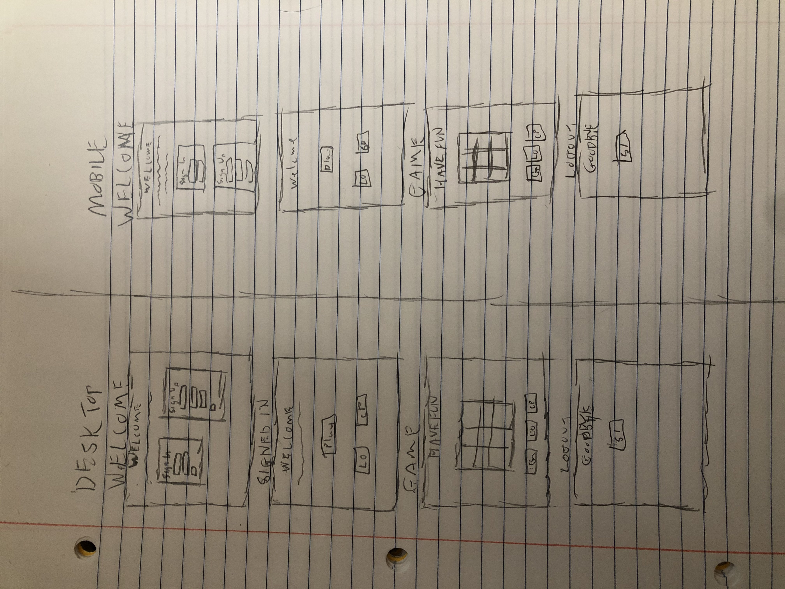

My TIC-TAC-TOE game

Wireframes:

User Stories:

As a new user, I want to create an account to gain access to the game.

As a returning user, I want to login using my credentials to gain access to the game.

As a logged in user, I want to be able to change my password at any time.

As a logged in user, I want to be able to log out at any time.

As a player, I want to be able to restart the game at any time.

As a player, I want to click a square and have my gamepiece display in that square.

As a player, I want the app to evaluate the game state and communicate if the game is over and if anyone won.

As a player, I want to be able to start a new game as soon as the last one is finished by clicking a button.

Description:
This application is a Tic Tac Toe game that requires the user to log in to play. Once signed in, the user will begin playing as X and then rotate back and forth between X and O. The game will stop when a win has been achieved and will register a tie if the game finishes with neither X or O achieving any win condition. The user may change their password and log out while signed in.

Play the game here: (https://ktresel2.github.io/tic-tac-toe/)
